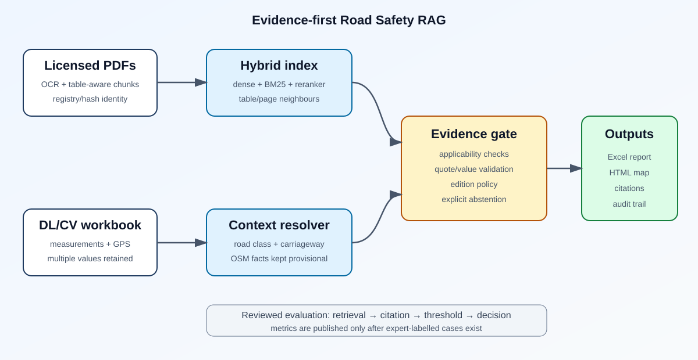
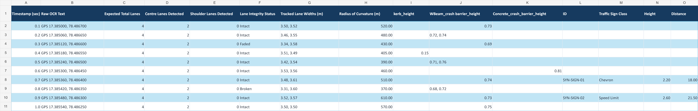
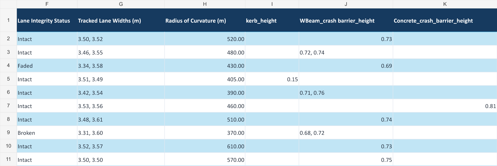

# Road Safety RAG

An evidence-first, offline-capable RAG pipeline that converts measurements from a road-inspection DL/CV system into location-specific IRC compliance findings.

The system compares observed road measurements with applicable values retrieved from Indian Roads Congress standards, classifies every geotagged location as Safe, Low, Medium, or High Severity, highlights unsafe locations on an interactive map, and generates targeted recommendations for each detected non-compliance.



## What makes this more than a chatbot

- Page-aware PDF ingestion with optional OCR, deterministic chunk identifiers, and table-aware row grouping that repeats captions, headers, and units.
- Hybrid dense + BM25 retrieval, cross-encoder reranking for final audits, neighbouring-page expansion, and exhaustive engineering-term scans.
- Registry/hash-first standard identity resolution; OCR/fuzzy guesses remain quarantined review candidates.
- Applicability gating for road class, terrain, carriageway, lane configuration, feature type, and speed basis.
- Quote, unit, comparator, value, standard, edition, and page validation before a threshold becomes audit-ready.
- Explicit `NEEDS_CONTEXT`, `AMBIGUOUS`, `INVALID_EVIDENCE`, and `NOT_APPLICABLE` outcomes instead of guessed values.
- Every measurement in a multi-value cell is evaluated; one failing required measurement makes that category fail.
- Location-level severity classification derived from observed IRC non-compliances.
- Corrective recommendations tied to the failed measurements and supporting evidence.
- Excel audit output and an interactive geotagged HTML map with evidence citations.
- Evidence quality is labelled as a heuristic diagnostic, not a probability.
- Strict source policy: unreviewed standards remain visible as candidates but cannot drive PASS/FAIL decisions.

The current severity labels are intended for screening and prioritisation. They are not a calibrated crash-prediction model or a substitute for an auditor-approved engineering risk assessment.

## Repository layout

```text
src/road_safety_rag/        canonical package
tests/                      deterministic unit and hygiene tests
config/                     registry and provenance templates
examples/                   synthetic, non-authoritative workbook
docs/                       architecture and screenshots
evaluation/                 reviewed-gold schema, protocol and result status
.github/workflows/ci.yml    automated tests and hygiene checks
pyproject.toml              package and CLI definition
pylock.toml                 resolved dependency lock
.gitattributes              consistent text and binary handling
```

`pylock.toml` is a reproducible PEP 751 lock generated for CPython 3.12 on Windows. Regenerate it on another operating system or Python version before using it as the installation source of truth.

Standards PDFs, vector databases, virtual environments, generated reports, and personal paths are excluded.

## Quick start

Requirements: Python 3.11+, Ollama, and legally obtained standards PDFs.

```text
python -m venv .venv
python -m pip install -e ".[rag,ocr]"
```

Copy `.env.example` to `.env`, set local corpus/database paths, and verify the installation:

```text
road-safety-rag doctor
```

For a guided run that optionally ingests standards before assessing a workbook:

```text
road-safety-rag wizard
```

Strict mode is enabled by default. `doctor` returns `NOT AUDIT READY` until every audited metric has at least one fully reviewer-verified standard policy. This is intentional: unverified evidence remains visible as a candidate but cannot produce PASS/FAIL.

For research-only provisional screening, set `ROAD_RAG_REQUIRE_VERIFIED_STANDARDS=false`. The resulting thresholds and findings remain explicitly marked `PROVISIONAL`; do not use that mode for statutory or contractual conclusions.

Build the private table-aware v3 index in a new database directory/collection:

```text
road-safety-rag index --folder "path/to/authorised/standards" --ocr --prune
```

`--prune` removes stale indexed files only within the configured corpus folder. The v3 builder refuses to mix legacy chunks with table-aware chunks. Keep v2 for comparison and use a new empty `chroma_db_v3`/`road_safety_codes_v3` target.

Three retrieval modes are available:

- `fast`: dense + BM25 retrieval without a cross-encoder.
- `balanced`: larger candidate pools followed by cross-encoder reranking.
- `audit`: exhaustive feature/unit scanning, wider neighbour recovery, and cross-encoder reranking. This is the default for the `audit` command and guided wizard.

The reranker is offline after it has been cached. If it is not already installed locally, temporarily set `ROAD_RAG_ALLOW_MODEL_DOWNLOAD=true` for the first run, then restore it to `false`.

Run the synthetic workbook through the audit:

```text
road-safety-rag audit examples/synthetic_road_measurements.xlsx --output outputs/audit.xlsx --html-output outputs/map.html --road-class "National Highway" --road-class-confidence 0.95 --setting rural --terrain plain --carriageway divided --lanes 4 --lanes-per-carriageway 2 --retrieval-mode audit
```

## Example outputs

| Synthetic workbook | Multi-value measurement detail |
|---|---|
|  |  |

The example workbook and screenshots contain synthetic measurements and are demonstration assets, not engineering findings. A generated map is intentionally not committed because it embeds observation-level location data. The HTML map loads Leaflet and OpenStreetMap tiles from the internet; opening it may disclose the viewed map area to those providers.

Route-specific coordinates, carriageway overrides, private figure transcriptions, standards PDFs, and vector indexes are intentionally absent from the public repository. Populate the empty local configuration files only for an authorised deployment.

## Evaluation status

The evaluation implementation reports Recall@5, Recall@10, mean reciprocal rank, citation/standard/edition/value/comparator/applicability accuracy, abstention precision and recall, end-to-end audit-decision accuracy, and latency by metric.

No expert-reviewed gold set has been supplied yet, so this repository publishes **no accuracy claim**. `evaluation/results/status.json` records the gap explicitly. After 50–100 independently reviewed cases are available:

```text
road-safety-rag evaluate path/to/reviewed_gold.json --with-llm --output evaluation/results/end_to_end.json
```

CI passing is software verification; it is not RAG-quality validation.

## Standards provenance

`config/standards_registry.json` is intentionally unverified. Before a showcase claims authoritative compliance, a qualified domain owner must record the active edition, amendments, supersession, authorised source, licence basis, reviewer, and review date. See `docs/CORPUS_PROVENANCE.md`.

A file hash proves integrity of the indexed copy only. It does not prove authenticity, licensing, currency, or applicability.

## Safety boundary

This project is decision support for portfolio and research use. Final road-safety findings require measurement validation, authoritative standards, applicable design records, and sign-off by a qualified road-safety auditor.
